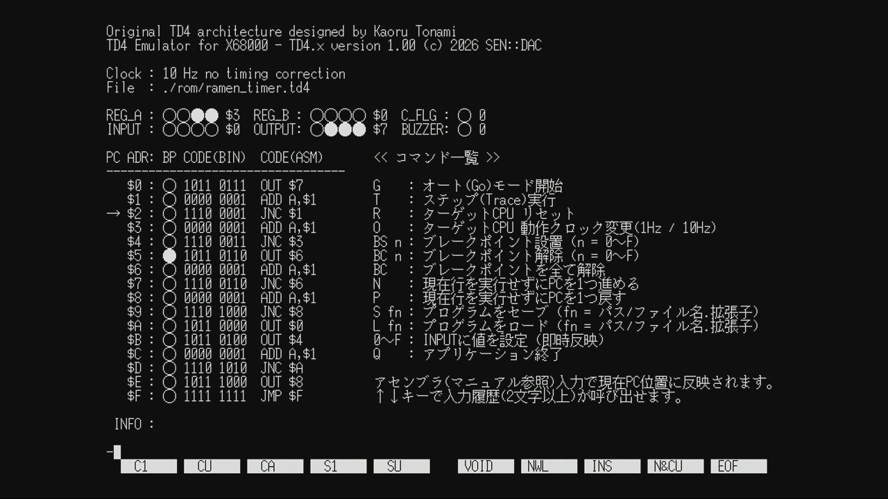

# X68000用 TD4エミュレータ & アセンブラ『TD4.x』ver. 1.00



## 概要

書籍『[CPUの創りかた](https://book.mynavi.jp/ec/products/detail/id=22065)』では、IC 10個で作られる「TD4」と呼ばれる4bitCPUの設計とその解説を通じ、CPU動作の基本原理を学べます。  

本ソフトは、この「TD4」のエミュレータであり、アセンブラとしても機能します。  

使用方法については、同梱テキストの [manual.txt](manual.txt) をご覧ください。  

## 開発の背景

TD4実機の作成は、様々な要因から敷居が高くなりがちです。  

そこで、エミュレータの利用を考えた場合、これまで以下のような選択肢がありました。  

---

#### ■ 書籍の公式エミュレータ  

メリット：  
[公式エミュレータ](https://book.mynavi.jp/supportsite/detail/4839909865.html)という安心感があります。  

デメリット：  
・TD4プログラムを保存した際のファイルフォーマットが、文字コードで 0 と 1 が書かれたテキスト形式、かつ、ファイルに直接マシン語でのプログラミングを行うのに適さないフォーマットとなっています。  

・Windows用ソフトであるため、将来的に使用できなくなる可能性があります。

未定義動作の挙動：  
一部のみが再現されています。  

---

#### ■ 有志作成のエミュレータ  

メリット：  
WEBブラウザ上で動作するものが多く手軽に利用できます。  

デメリット：  
・TD4プログラムを保存する機能がない場合が多いです。  

・WEBページが消滅していることが多々あります。  

未定義動作の挙動：  
未定義の命令やImを全て無視するエミュレータが多いです。  
(仕様上の動作をとる方針と解釈)  

---

本ソフトは上記の各デメリットを解消し、さらにTD4から学べることの最大化を目指し、以下の要件を満たすものとして開発を始めました。

・ファイルのセーブ/ロード機能がある  
・生のバイナリファイルとして人力でマシン語の解読/記述が可能  
・TD4実機における未定義動作時の挙動を全て再現する  
・ローカルな環境で動作  
・ブラックボックスが少ないレガシーな環境(X68kなど)上で動作    

## 本ソフトの特徴

#### ■ 未定義動作の再現

TD4におけるマシン語は、全て1命令が1バイトとなっており、上位ニブルに命令種別、下位ニブルにIm(イミディエイトデータ)が入る形で統一されています。  

また、MOV A,B など、Imを持たない命令の下位ニブルは0である必要があります。  

ここで、以下の2パターンの未定義動作発生の可能性があります。  

① 上位ニブルが命令として存在しない値である  
② Imを持たない命令の下位ニブルに0以外の値が入っている  

既存のTD4エミュレータは、この未定義動作については無視されるものが多いです。  
(仕様上の動作をとる方針と解釈)  

これに対し、本ソフトではTD4実機を作成し、回路そのままの挙動を再現する方針としています。  
(nucky氏が頒布されたPCB基板を利用させていただきました)  

実機挙動の確認および本ソフトの検査結果は[こちら](./InspectionSheet.ods)になります。

なお、未定義動作は、アセンブラでコーディングした場合は発生しません。  

マシン語でコーディングした場合のみ、発生する可能性があります。  

---

#### ■ デバッガ風のUI

TD4実機は、入出力や表示が全て2進数で扱われ、これらはDIPスイッチやLEDで実装されています。  

既存のTD4エミュレータは、これを再現してチェックボックス等で2進数の入力を行うものが多いです。  
(マシン語入力の体験を促す方針と解釈)  

これに対し、本ソフトはデバッガ風のUIをコマンドで操作し、アセンブラでコーディングを行い、値は16進数で扱う方針としています。  

---

#### ■ ファイルのセーブ / ロードに対応

作成したTD4用プログラムを セーブ / ロード する事が可能です。  

TD4のROM内容そのままのフォーマットですので、バイナリエディタ等でマシン語として編集できます。  

このため、TD4公式エミュレータの.td4ファイルとは互換性がありませんので、ご注意ください。  

---

#### ■ 逆アセンブラの表示

ロードしたプログラムは、マシン語(2進数および16進数)表示のほか、逆アセンブラも同時に表示されます。  

---

#### ■ アセンブラによるコーディングが可能

既存のTD4エミュレータは、マシン語によるコーディングのみに対応しているものが多いです。  

それに対し、本ソフトは、アセンブラによるコーディングに対応しています。  
(マシン語コーディングの場合はバイナリエディタで行い、そのファイルをロード)  

書籍『CPUの創りかた』に記載されている書式をベースに、値は16進数で記述する方式に変更しています。  
レジスタ名なのか、16進数なのかを判別するために、値の前には必ず16進数を表す $ が必要です。  

これにより、実機や既存のTD4エミュレータに比べ直感的なプログラミングが可能になっています。  

---

#### ■ ブレークポイント機能

ROM領域の任意の命令行(アドレス)にブレークポイントを設置することが可能です。  

最大で16行しかないプログラムですので、あまり必要がないかも知れませんが。  


## 開発時間・プロセス

合計：200時間  

原本の作業時間記録より視認性向上のため粒度調整を行った結果、時系列は多少前後しています。  

- 試作フェーズ  
24.0H：[実装] プロトタイプ完成  

- 改良フェーズ  
05.0H：[分離] (CPU層) ←→ (デバッガ層)  
05.0H：[分離] (デバッガ層) ←→ (コマンド層)  
03.0H：[改善] (CPU層)  
06.0H：[改善] (コマンド層)  
02.0H：[改善] (デバッガ層)  
06.0H：[改善] 描画処理  
04.5H：[改善] UI表示調整  

- 機能追加フェーズ  
03.0H：[実装] (コマンド層) 追加：アセンブラ命令  
06.0H：[実装] (コマンド層) 追加：0～F, R, L, S, N, P, BPS, BPC  
02.0H：[検討] IN=JOYポート, OUT=プリンタ → ver1.00では保留  
03.0H：[実装] 機能：1Hz動作  
01.0H：[実装] 機能：ブレークポイント  
12.0H：[実装] 機能：ヒストリ  
03.0H：[実装] .iniロードモジュール  
04.0H：[実装] メモリマップモジュール  
04.0H：[修正] バグ修正  

- ソースコード公開用整備フェーズ  
66.5H：[洗練] リファクタリング  

- 検査フェーズ  
10.0H：[検査] 実機挙動確認・検査シート作成  
07.0H：[実装] (CPU層) 未定義動作  
03.0H：[検査] ソフトウェア動作確認  

- ドキュメント整備フェーズ  
10.0H：[資料] マニュアル作成  
10.0H：[資料] README.md 作成  

所感：  
リファクタリング時間 ：33.25%  
資料作成に要した時間 ：10%  
検査に要した時間     ：6.5%  

これらの工程は合計で全体(200H)の49.75%を占めています。  

単にソフトを制作するだけではなく、公開のためのコストが非常に高い事が分かります。  

前回の[BB68K](https://github.com/sen-dac/BLOCK-BREAK-PRO-68KZ)でも、公開のために行ったリファクタリング時間が作業時間全体の26%を占めていました。  


## ディレクトリとファイル構成

```text
.
│
├─ [rom]                [TD4サンプルプログラム]
│   └ ramen_timer.tdx   ラーメンタイマー
│
├─ [src]                [ソースコード]
│   │
│   ├─ [cpu]            [CPU]
│   │   └ cpu.c/h       CPU層：ターゲットCPUの定義と処理
│   │
│   ├─ [dbg]            [デバッガ]
│   │   ├ dbg.c/h       デバッガ層：デバッガのメイン処理
│   │   ├ dbg_cmd.c/h   コマンド層：コマンド処理
│   │   └ dbg_his.c/h   コマンド入力のヒストリ機能
│   │
│   ├─ [lib]            [ライブラリ]
│   │   ├ crt.c/h       CRTモジュール (V-BLANKを1Hz近似モード時間制御に使用)
│   │   ├ inifile.c/h   .ini ファイルのロードモジュール
│   │   ├ keycode.h     キーグループとキーコードの定義
│   │   └ type.h        基本型の定義
│   │
│   ├─ [mem]            [メモリマップ]
│   │   └ mem.c/h       ターゲットCPU上で利用するメモリ空間の定義
│   │
│   ├ main.c/h          メイン処理 (エントリポイント)
│   └ StdAfx.h          共通インクルードファイルの集約
│
├ cl.bat                ビルド時に生成されるファイルの一括削除
├ InspectionSheet.ods   TD4実機と本ソフトの動作確認結果
├ makefile              makeファイル(makeコマンドでビルドします)
├ manual.txt            ユーザー向けドキュメント
├ README.md             開発者向けドキュメント
├ TD4.ini               アプリ起動時にのみ読み込まれる設定ファイル
└ TD4.x                 TD4.x 実行ファイル
```


## 型定義

本ソフトのソースコードは、型サイズと符号を明確にする目的で以下の型を定義しています。  
※ 環境依存の型サイズ差異を排除するためのローカル規約です。  

[src/lib/type.h](src/lib/type.h)

```
typedef signed char    S1;
typedef signed short   S2;
typedef signed long    S4;
typedef unsigned char  U1;
typedef unsigned short U2;
typedef unsigned long  U4;
typedef U1             BL; // bool : TRUE / FALSE
typedef void           VD; // void
```


## ビルド方法

本作は以下の開発環境・ツールチェーンを使用してビルドを行っています。

* Human68k
* GCC真里子版 (ver1.42)
* XCライブラリ

`make` コマンドでビルドが可能です。  


## 起動方法

同梱テキストの [manual.txt](manual.txt) をご覧ください。  

## 今後の課題

#### ■ 今回は見送った機能の実装  
TD4入力ポートをX68000のジョイスティックポートに、TD4出力ポートをX68000のプリンタポートに接続する構想がありました。  

しかし、入力取得タイミグに関連して大幅な改修が必要であることが判明したため、今回の実装は見送りました。

これに合わせてプリンタポートへの出力も今回は見送っています。

#### ■ 8bitCPU化  
書籍『CPUの創りかた』(P.304～)「8bit化」の実装。

CPU層について：  
もともとCPU層は拡張性を考慮して作成しているため、8bit化そのものは比較的容易と考えられます。  

プログラムカウンタが8bitになり、256ステップ命令が扱えるようになります。  

描画やUIの問題：  
現状16ステップのプログラムリスト表示に時間がかかっており、256ステップの表示に対応するため、スクロールやページ切り替えを行った場合、1Hz動作でも描画が間に合いません。  

このため、描画やUI表示の処理に大幅な改修が必要となり、ここに工数がかかる見込みです。  

入力ポートの問題：  
X68000のジョイスティックポートを入力端子として利用する場合、有効なビットが6bitしかない事も課題となります。  

現状の4bitCPUであれば足りますが、8bitCPUになると2ビット足りません。  

ジョイスティックポートに接続する専用ハードウェアの製作も合わせて行えば解決しますが、その場合は他のユーザーが環境を再現できなくなってしまいます。  

## ライセンス

Copyright (c) 2026 SEN::DAC

